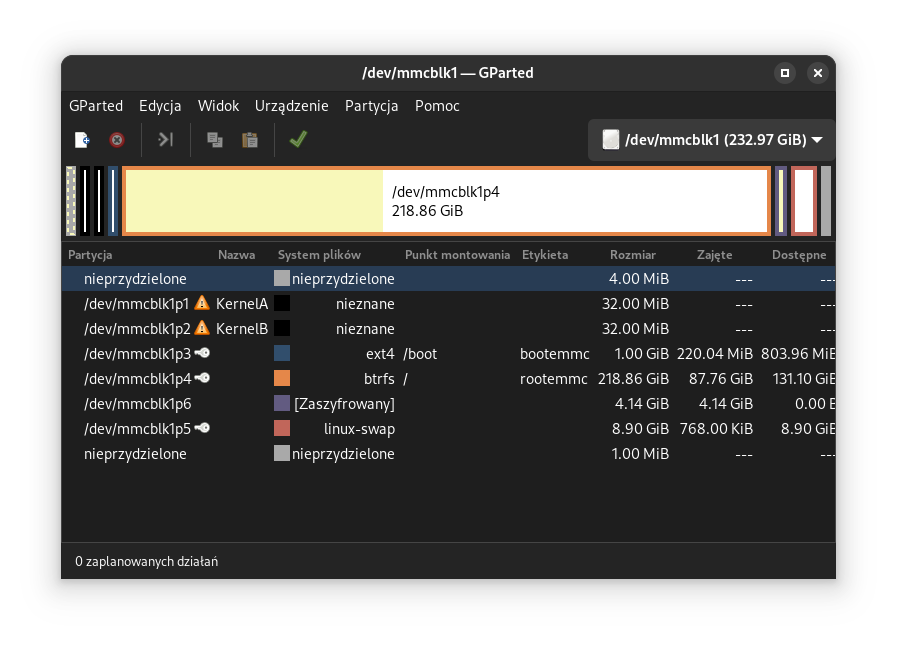
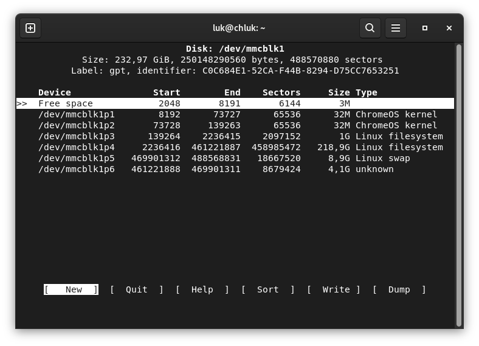

# The Encrypted installation

- **before proceeding** with installation it is recommended to first [set gbb flags](./setting_gbb_flags.md) (especially if you install it directly onto chromebook memory)

- if you want **diffrent username** (default is linux)

login as linux (password "changeme"), open terminal and type

```
sudo passwd root
```
this will let you change root password

logout and login as root and run script
```
/scripts/rename-default-user.sh mypreferredusername
```

_Note. if the user is used by some process just kill it (```kill <process id>```) and run the command again which should throw a group error but don't worry about it :3_

# Let's just do it

_Note. this installetion doesn't have to be performed on internal memory, it can also be done on another usb or sd card_

_Important. it is asummed you do all this as root use ```su root``` or ```sudo -i```_

1. start by listing all available disks

```
lsblk
```
the output should look like this
```
NAME         MAJ:MIN RM   SIZE RO TYPE MOUNTPOINTS
mtdblock0     31:0    0     8M  0 disk 
mmcblk1      179:0    0 116,5G  0 disk <- this is a disk
├─mmcblk1p1  179:1    0    64M  0 part <- this is a partition
├─mmcblk1p2  179:2    0    64M  0 part 
├─mmcblk1p3  179:3    0   512M  0 part /boot
├─mmcblk1p4  179:4    0 107,9G  0 part /
└─mmcblk1p5  179:5    0     8G  0 part [SWAP]
mmcblk1boot0 179:32   0     4M  1 disk 
mmcblk1boot1 179:64   0     4M  1 disk
```

now in order to make it simple to just copy and paste the commands
we will export the correct drive as a environment variable but i still encourage you to read as much as possible here

_Note. remmber to do it whenever you want to repeat any of steps below_

- if you want to install onto ```mmcblk0``` or ```mmcblk1``` (number is diffent on diffrent chromebooks)
```
export disk=mmcblk0
export part=mmcblk0p
```
or
```
export disk=mmcblk1
export part=mmcblk1p
```
respecitively

- if you want to install on sda or similar
```
export disk=sda
export part=sda
```

3. prepare the disk

wipe the target disk first
```
apt-get install cgpt # should be already installed
sgdisk -Z /dev/${disk}
partprobe /dev/${disk}
sgdisk -C -e -G /dev/${disk}
partprobe /dev/${disk}
cgpt create /dev/${disk}
partprobe /dev/${disk}
```

create kernel partition
```
cgpt add -i 1 -t kernel -b 8192 -s 65536 -l KernelA -S 1 -T 2 -P 10 /dev/${disk}
cgpt add -i 2 -t kernel -b 73728 -s 65536 -l KernelB -S 0 -T 2 -P 5 /dev/${disk}
```
_Note. for veyron chromebooks you need to run ```cgpt repair /dev/mmcblk0``` after each command_

4. add the rest of partitions

it should look like this

```
32M ChromeOS kernel <- we already made
32M ChromeOS kernel <- same
512M Linux filesystem <- create this
28.6G Linux filesystem <- and this
```
_Note. some newer chromebooks can boot 64mb partitions but for now let's stick to 32mb ones_

- you can edit partitions graphically using gparted(```sudo apt install gparted```)

- or in terminal using fdisk
```
fdisk /dev/${disk}
```

- or more graphically but still in terminal with cfdisk (```sudo apt install util-linux```)
cfdisk /dev/${disk}
```


_Note. you don't need to format them or select specyfic type, just make them correct size we will format them later_

_Warning. this images are for software look showcase and to make it easier for you to chose the most comfortable one for you <3, partition your device the way described in the guide, not the way presented on the images_

1. make filesystems

format boot partition
```
mkfs -t ext4 -O ^has_journal -m 0 -L bootemmc /dev/${part}3
```
_Note. -L argument specyfies the partition lable which you can change if you want_

format encrypted root partition
```
cryptsetup luksFormat /dev/${part}4
```
map encrypted partition
```
cryptsetup open --type luks /dev/${part}4 encrypted
```
create filesystem there
```
mkfs -t btrfs -m single -L rootemmc /dev/mapper/encrypted
```
mount filesystem to /mnt
```
mount -o ssd,compress-force=zstd,noatime,nodiratime /dev/mapper/encrypted /mnt
cd /mnt
mkdir -p /mnt/boot
mount /dev/${part}3 /mnt/boot
```

6. copy over the usb filesystem
 
now we sync filesystem with the one on the installation medium
```
rsync -axADHSX --no-inc-recursive --delete /boot/ /mnt/boot
rsync -axADHSX --no-inc-recursive --delete --exclude='/swap/*' / /mnt
```

7. setup swap (optional but recommended)

setup swap folder
```
rm -rf /mnt/swap
btrfs subvolume create /mnt/swap
chmod 755 /mnt/swap
chattr -R +C /mnt/swap
btrfs property set /mnt/swap compression none
cd /mnt/swap
```
With newer kernels / btrfs tools the property setting command might result in a warning which can be ignored in such cases - it should still work fine.

_See. [full disk encryption with btrfs swap and hibernation](https://blog.passcod.name/2020/jun/16/full-disk-encryption-with-btrfs-swap-and-hibernation)_

we can make

- single file better for hibernation
```
truncate -s 0 ./file.0; btrfs property set ./file.0 compression none; fallocate -l 2G file.0; chmod 600 ./file.0; mkswap -L file.0 ./file.0
```
- or multiple files for more flexibility
```
for i in 0 1 2 3 ; do truncate -s 0 ./file.$i; btrfs property set ./file.$i compression none; fallocate -l 512M file.$i; chmod 600 ./file.$i; mkswap -L file.$i ./file.$i; done
```

8. setup required files

now let's setup some important files

- Adjusting partitions and swap mounted at boot
```
nano /mnt/etc/fstab
```
should look like this
```
# /etc/fstab: static file system information.
#
# <file system> <mount point>   <type>  <options>       <dump>  <pass>
# LABEL=rootemmc / ext4 defaults,noatime,nodiratime,errors=remount-ro 0 1
LABEL=rootemmc / btrfs defaults,ssd,compress-force=zstd,noatime,nodiratime 0 1
LABEL=bootemmc /boot ext4 defaults 0 2
/swap/file.0 none swap sw 0 0
#/swap/file.1 none swap sw 0 0
#/swap/file.2 none swap sw 0 0
#/swap/file.3 none swap sw 0 0
```
_Important. remmber to double check the disk lables are the same as the lables set during step 5_

_Note. adjust the swap and add all swap files you've created_

- Adjust the **encrypted** partitions mounted at boot
```
blkid
```
output:
```
/dev/mmcblk0p3: LABEL="bootemmc" UUID="ae2dfad1-f078-40f3-9542-defb28394228" BLOCK_SIZE="4096" TYPE="ext4" PARTUUID="a4621290-1765-406b-bf80-92d91a313815"
/dev/mmcblk0p4: UUID="5e9ef95e-3b51-4525-898f-419a0b0a6e4f" TYPE="crypto_LUKS" PARTUUID="086cb1ce-1ddb-4304-811e-5e1752836da5"
/dev/mapper/encrypted: LABEL="rootemmc" UUID="f9c4038c-3625-45f5-9510-94ddc1bb7b23" UUID_SUB="ab69e1dc-5a73-4f0b-8dee-d5b87586d9b5" BLOCK_SIZE="4096" TYPE="btrfs"
/dev/mmcblk0p1: PARTLABEL="KernelA" PARTUUID="88b9134a-9886-304f-a735-a97301c40284"
/dev/mmcblk0p2: PARTLABEL="KernelB" PARTUUID="bad61d81-12d2-4c47-81d6-89e2f0f4157e"
```
find the partition UUID and copy it or note down

_Info. in our case we are looking for UUID of an encrypted (not mapped one) partition with TYPE "crypto_LUKS" which in this example is "5e9ef95e-3b51-4525-898f-419a0b0a6e4f"_

_Warning. make sure you aren't looking at PARTUUID_

now open the crypttab file
```
nano /mnt/etc/crypttab
```
and put in this
```
# <target name> <source device>         <key file>      <options>
encrypted UUID=5e9ef95e-3b51-4525-898f-419a0b0a6e4f none luks,discard
```
_Note. remember to adjust the UUID to yours_

- Enable xz compression for initrd (in theory optional but recommended)

_Note. saves space in /boot and makes initrd smaller for fit image in case that is needed - memlimit might need adjustment in case update-initramfs gives an error_

open the /etc/initramfs-tools/conf.d/compress file
```
nano /mnt/etc/initramfs-tools/conf.d/compress
```
and put this inside
```
COMPRESS=xz
XZ_OPT='-9 --check=crc32 –memlimit-compress=25%'
```

9. final adjustments

start by entering the chroot
```
chroot /mnt mount -t proc proc /proc 
chroot /mnt mount -t sysfs sysfs /sys 
mount --bind /dev /mnt/dev 
mount --bind /run /mnt/run
chroot /mnt
```
_Note. this will make it so, the target disk will be treated like a root directory in that terminal as long as you don't type ```exit```_

_Note. after entering the command, if you want to be sure you are still in chroot, you can type ```export PS1="(chroot) ${PS1}"``` (it doesn't check for being inside chroot but gives visual indicator untill u exit it)_

<details>
<summary>if you messed up and want to enter chroot again after reboot
</summary>

you need to export the drive and part from part one again (look up)
and mount the partitions again
```
#root
cryptsetup open --type luks /dev/${part}4 encrypted
mount -o ssd,compress-force=zstd,noatime,nodiratime /dev/mapper/encrypted /mnt
#boot
mount /dev/${part}3 /mnt/boot
```
and then run commands to enter chroot again
</details>

now in the /boot directory create as "simple script" :3
```
nano /boot/kernel-and-initrd.sh
```
<details>
<summary>here is the script</summary>

```
#!/bin/bash

if [ "$(whoami)" != "root" ]; then
  echo "This script must be ran as root."
  exit 1
fi

cd /boot || exit

# choosing kernel version

if [ "$#" != "1" ]; then
  echo "Note. no kernel specified, going with current kernel"
  kver=$(uname -r)
fi

if [ "$#" == "1" ]; then
  kver=${1}
fi

echo "kernel chosen ${kver}"

#checking presence of the kernel

if [ ! -e "Image-${kver}" ]; then
  echo "Image-${kver} seams to be missing"
  echo "this kernel version doesn't seam to be present"
  exit 1
fi

#it is better to regenerate initramfs everytime
#if [ ! -e initrd.img-${kver} ]; then
#  echo "initrd.img-${kver} seams to be missing, trying to generate"
  update-initramfs -c -k "${kver}"
#fi

if [ ! -e "initrd.img-${kver}" ]; then
  echo "sorry. unable to generate one TwT"
  exit 1
fi

if [ ! -e cmdline ]; then
  echo "cmdline seams to be missing"
  echo "Note. will create one for you"
  echo "console=tty1 root=LABEL=rootemmc rootwait ro fsck.fix=yes fsck.repair=yes net.ifnames=0 ipv6.disable=1 quiet splash" > cmdline
  
  #cbq requires additional cmdline
  if echo "$kver" | grep -q "cbq"; then
    echo "there is cbq"
    echo " deferred_probe_timeout=30 clk_ignore_unused=1" >> cmdline
  fi


  cat cmdline

fi

#generating required files
cp -v "vmlinux.kpart-initrd-${kver}" "vmlinux.kpart-initrd-${kver}.old" 2> /dev/null
cp "Image-${kver}" Image
lzma -9 -z -f -k -v Image
cp "initrd.img-${kver}" initrd.img.xz

#moved cmdline to seperate file to make it cleaner to edit
# for cbq add: deferred_probe_timeout=30 clk_ignore_unused=1
#echo "console=tty1 root=LABEL=rootemmc rootwait ro fsck.fix=yes fsck.repair=yes net.ifnames=0 quiet splash>" > cmdline

dd if=/dev/zero of=bootloader.bin bs=512 count=1

# adjust to dtb names here:
# - cbg: dtb-${kver}/rk3399-gru-*.dtb
# - mt7: dtb-${kver}/mt8173-*.dtb
# - mt8: dtb-${kver}/mt8183-*.dtb
# - cbq: dtb-${kver}/sc7180-trogdor-*.dtb
# - generic: dtb-${kver}/*.dtb
#Note. you can specufy only dtb for your specyfic device to reduce space
#even further but lose portability. PLS BE CAREFUL, if you select wrong
#one the device will likely no work

ls dtb-${kver}/*.dtb | xargs printf " -b %s" | xargs mkimage -D "-I dts -O dtb -p 2048" -f auto -A arm64 -O linux -T kernel -C lzma -a 0 -d Image.lzma -i initrd.img.xz kernel.itb
vbutil_kernel --pack vmlinux.kpart --keyblock /usr/share/vboot/devkeys/kernel.keyblock --signprivate /usr/share/vboot/devkeys/kernel_data_key.vbprivk --version 1 --config cmdline --bootloader bootloader.bin --vmlinuz kernel.itb --arch arm
cp -v vmlinux.kpart "/boot/vmlinux.kpart-initrd-${kver}"

#cleanning up
rm -f Image Image.lzma initrd.img.xz bootloader.bin kernel.itb vmlinux.kpart


#final output

#getting where root is mounted from, /dev/mmcblk0p4 or /dev/sda4 or /dev/mapper/encrypted
root=$(findmnt -n -o SOURCE /)

#encrypted partitions are inside /dev/mapper/
if echo $root | grep -q "mapper"; then
  rawname=$(echo $root | sed 's/\/dev\/mapper\///') #first we remove useless part
  root=/dev/$(lsblk -no NAME --raw | grep -B1 $rawname | head -n 1) #then we get partition before encrypted on in lsblk
fi

#obtains the /dev/mmcblk1p or /dev/sda or similar
kpart=$(echo $root | sed 's/.$//')

#obtains parent disk, since sometimes there is p it otherwise would be tricky
pdisk=$(lsblk -no PKNAME $root | head -n 1)

#printing results
echo ""
echo "for single boot only testing:"

#echo "IMPORTANT: please double check your mmcblk device name beforehand"
#already take care of above

echo ""
echo "  dd if=/boot/vmlinux.kpart-initrd-${kver} of=${kpart}2"
echo "  cgpt add -i 2 -S 0 -T 1 -P 15 /dev/${pdisk}"
echo ""
echo "to always boot this kernel after successful testing:"
echo ""
echo "  dd if=/boot/vmlinux.kpart-initrd-${kver} of=${kpart}1"
echo ""

```
</details>

you can also find it [here](./kernel-and-initrd.sh)

make it executable
```
chmod +x /boot/kernel-and-initrd.sh
```
and run once
```
/boot/kernel-and-initrd.sh
```

after script is done you need to flash the "to always boot this kernel ..."

_Note. if you want to modify kernel cmdline, after first run the script will generete a cmdline file at /boot/cmdline , you can edit it and rerun script again then flash the image, ofc you can also do that later without chroot if you boot into actual system_ 

_Note. we're flashing this image to always boot because when at first non of partitions here contain kernel with proper initramfs, later when upgrading the kernel or cmdline, it's a good idea to test the kernel first so you don't brick you system_

_Note. please make sure that there is enough space in /boot before running this script (when working there with multiple kernel versions, some older unused ones might habe to be removed first) and watch out for potential errors when running it as they might result in a broken and unbootable kernel in the worst case_
_Note. if something goes wrong and you can't see what because of splash screen, you can remove ```quiet splash``` from /boot/cmdline and rerun the script, then reflash_

_Note. if you want to make and image for a newer/diffrent kernel version than current one (for example to upgrade), run the script like this ```/boot/kernel-and-initrd.sh <kernel version>``` for example ```/boot/kernel-and-initrd.sh 6.6.23-stb-cbq+```_

exit the chroot and reboot
```
exit
reboot
```

and hope everything went right

# What now?

now after the system is installed onto memory you can look into [what next](./post-installation.md) you can do on your device