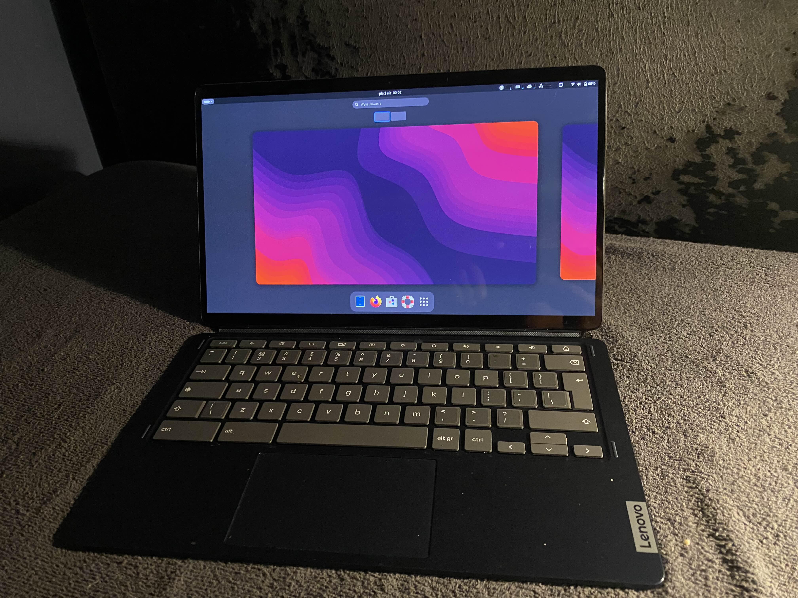

# Customization time

_To-do. update the image to sth nicer, .gif of diffrent de and stuff_

now that you are done with installation there are some additional things you want to setup on your device :

- Change username - [the "linux" username doesn't suite my vibe](./post/change-username.md)

- Modifying keyboards keys - [modify specyfic specjal key to your needs](./post/modifying-keyboard.md)

- Modifying hostname - modify the hostname of your device

- Installing desktop environment - i want my desktop to look diffrent

- Fixing firefox touch screen - the touch screen doesn't let me scroll

- Install waydroid - i want to play use android apps

- Setup splash screen - feel need for my boot screen to look nice

- Getting wacom tablets to work - need to draw something on my tablet