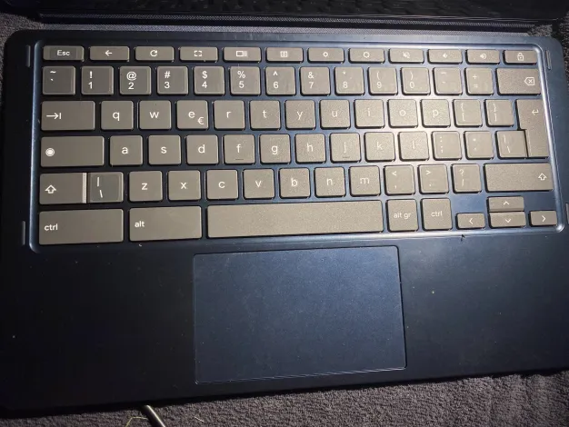

# Modifying keyboard keys

as we know chromebooks have special keyboard with some keys missing or being different


i thought i might go over a process of modifying the keyboard to make it function "properly" (it's up to preference)

# Universal solution
the easiest way to modify specyfic key on a keyboard is using [keyd](https://github.com/rvaiya/keyd)

we can install it on our system with following commands
```
git clone https://github.com/rvaiya/keyd
cd keyd
make && sudo make install
sudo systemctl enable keyd && sudo systemctl start keyd
```

after that modifying keys is as easy as editing ```/etc/keyd/default.conf``` and running ```sudo keyd reload```

currently on my machine (lenovo IdeaPad duet 5) i use this config
```
[ids]

*

[main]
#the format is
#key to replace = new key

#since keyboard on newer chromebooks replace f1-f12 keys with special keys this brings the keys the state i need them to be
#zoom back to f3
zoom = f3
#back back to f1
back = f1

#this makes the lock button act as delete key
sleep = delete
#different chromebooks might call that button different way so use command below to be sure
```

in order to check the name of button on a keyboard you can use ```sudo keyd monitor``` command

to make it easier on ppl wandering here are names for special keys
on older chromebooks u can set f1-f12 key to act the way it's shown on physical keyboard
- ```volumeup```
- ```volumedown```
- ```mute```
- ```brightnessup```
- ```brightnessdown```
_i think the names are self-explanatory_

for more info on this program pls visit https://github.com/rvaiya/keyd

this i an universal way but not the only one

# Gnome specific way

when it comes to gnome, inside settings -> keyboard -> show and customize shortcuts
you can bind specific button to specific shortcut
the brightness manipulation is missing from settings but you can set it with this commands
```
gsettings set org.gnome.settings-daemon.plugins.media-keys screen-brightness-down "['F6']" 
gsettings set org.gnome.settings-daemon.plugins.media-keys screen-brightness-up "['F7']"
```
Note. this is only for old chromebooks, modern chromebooks already work without this set