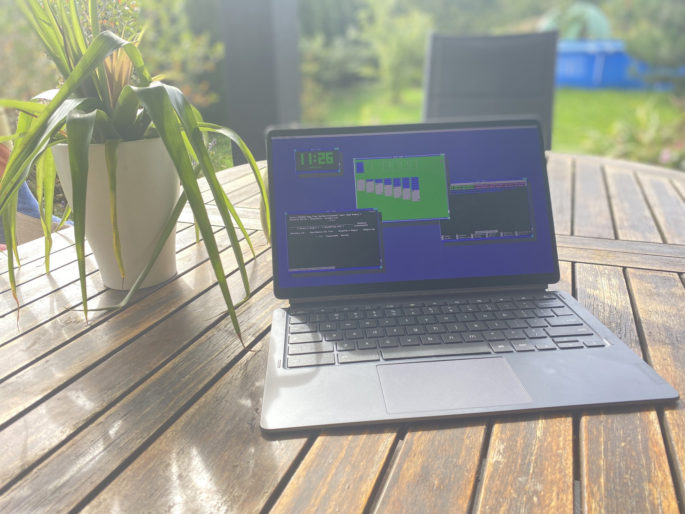
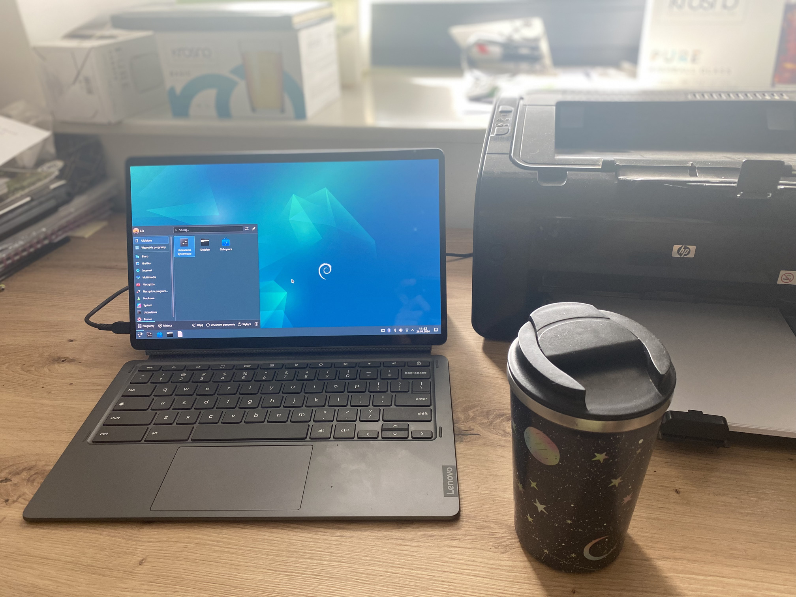
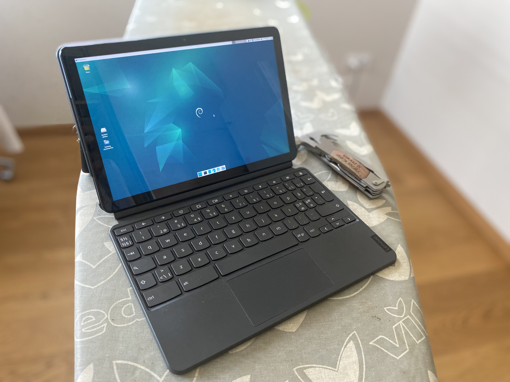

# So you want your desktop look diffrent

there are few fine options covered with this guide


look below for instructions on installation of selected de's

## Gnome

great looking out of the box experience <3


installation on debian is fairly straight forward

```
sudo apt install gnome-core
```
_Note. you can also install ```task-gnome-desktop``` instead if you want to install additionall packages (games and similar)_

_Note. during the installation you might be asked to pick display manager, default for gnome is ```gdm```, picking other option will result in gnome lock screen not working_

## Twin

lightweight with retro vibe



_Warning. this DE requires kernel with [CONFIG_INPUT_MOUSEDEV enabled](https://github.com/hexdump0815/imagebuilder/issues/237) **to be accesed via tty**, currently provided kernel doesn't have that, if you use a kukui or trogdor chromebook you can get kernel with that option on from [here](https://github.com/hexdump0815/imagebuilder/discussions/243#discussioncomment-10659997), otherwise you need to compile a kernel yourself_

### installing the project
start by installing all deps

```
sudo apt install libx11-dev libxft-dev libncurses-dev zlib1g-dev libgpm-dev gpm
```
colne the twin repo
```
git clone https://github.com/cosmos72/twin
cd twin
```
build the project
```
./configure
make
```
install the project
```
sudo make install
```

### getting into twin

**in a window**

you can run the project in a window by running ```twin``` within graphical session

**in a tty (recommended)**

to enter a tty you need to press ```[ctrl]```+```[alt]```+```[f2]```/```[f3]``` and logging in

_Note. on some devices function keys (```fX```) are replaced with special keys, you can bring them back by [modifying the keyboard](./modifying-keyboard.md)_

in tty (make sure you have CONFIG_INPUT_MOUSEDEV) by typing ```twin```

_Note. if you want to boot straight into tty you will need to uninstall your graphical environment ```sudo apt purge *xfce* *lightdm*``` should do the job, remember befor doing that make sure you know how to connect to the internet from tty (Hint. ```nmtui``` command should do the job unless you uninstall it)_

## Kde

for ppl who like to customize everything possible



installation on debian is fairly straight forward

```
sudo apt install task-kde-desktop
```

## Xfce (default)

lightweight and very customizable



installation on debian is fairly straight forward

```
sudo apt install task-xfce-desktop
```