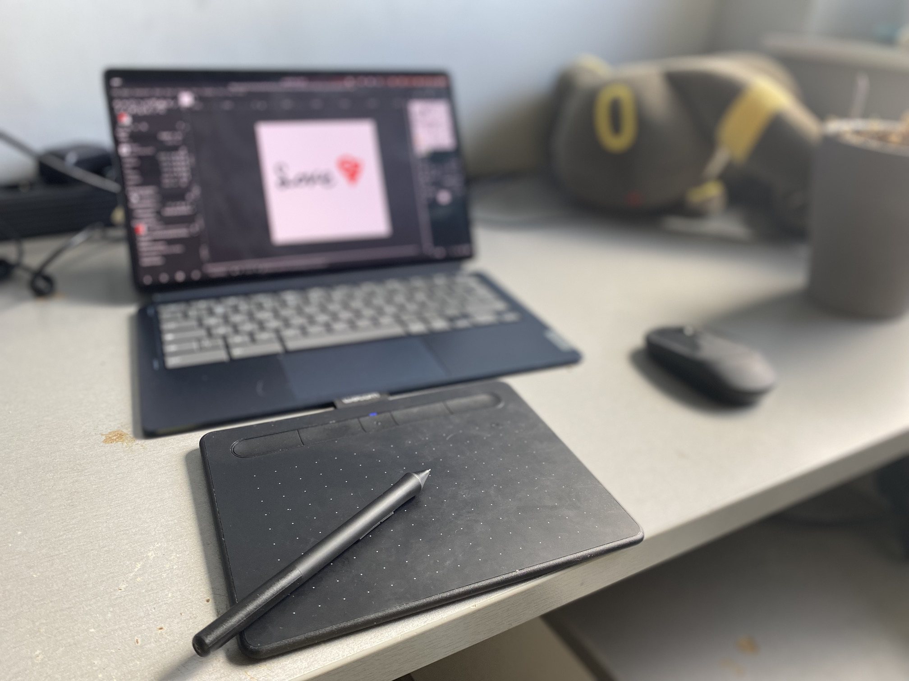

# Getting wacom tablets to work

the image doesn't provide wacom drivers preinstalled so we need to get them ourselves


_ideapad duet 5 with wacom tablet and the [MASTER PICE <3](./assets/love.png)_

### Where we begin

_Warning. this requires [kernel headers to be installed](https://github.com/hexdump0815/imagebuilder/blob/main/doc/installing-kernel-headers.md)_

download deps
```
sudo apt-get install build-essential autoconf
```

clone the drivers repo
```
git clone https://github.com/linuxwacom/input-wacom
cd input-wacom/
```

compile the driver
```
./autogen.sh 
./configure 
make -j8
```

install the driver
```
sudo make install
```

for good measure
```
sudo dd if=/boot/vmlinux.kpart-xyz of=/dev/mmcblk1p1
```
_Note. replace xyz with your kelner version + assuming your system is installed to mmcblk1_

and reboot

### your device should be good to go

_Fun Fact. did you know you can print out your bash history with ```history <number>``` command_