# Intro ... getting stuff to boot

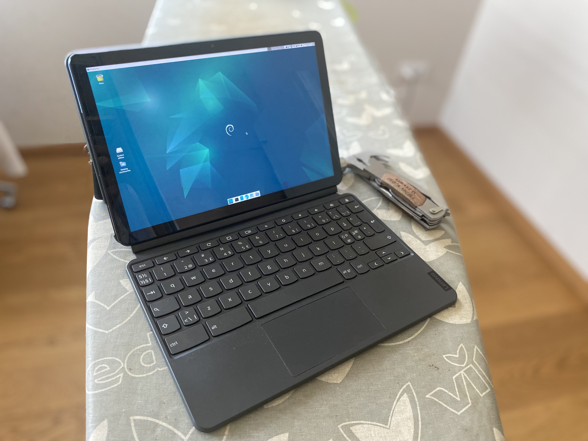

in order to get these images to even boot on your device there are some steps you need to do, below you can see all the required steps

_Note. before getting your device to boot you might be interested in looking at [device specyfic notes](./systems/readme.md)_

# Enabling Developer mode

_Warning. this step will WIPE ALL YOUR DATA from you chromebook so if you have anything of value there, pls copy it somewhere else_

### entering the boot menu

**on laptops**

hold ```[esc]```+```[refresh]``` and press ```[power]```/```[lock]```

**on tablets**

turn off your device and

hold ```[volume-up]```+```[volume-down]``` and press ```[power]```

<details>
<summary>on older laptops</summary>

you should be booted into recovery screen
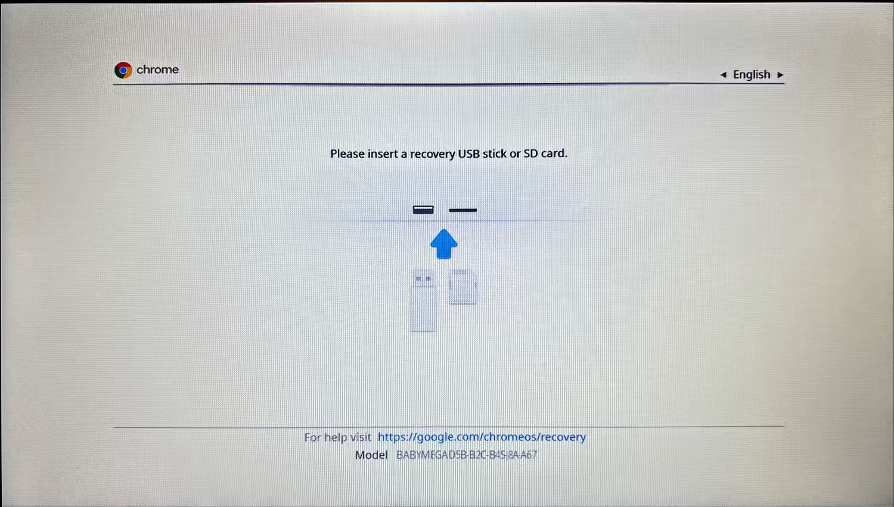
_[image source](https://www.howtogeek.com/210817/how-to-enable-developer-mode-on-your-chromebook/)_

in here you need to press ```[ctrl]```+```[D]```

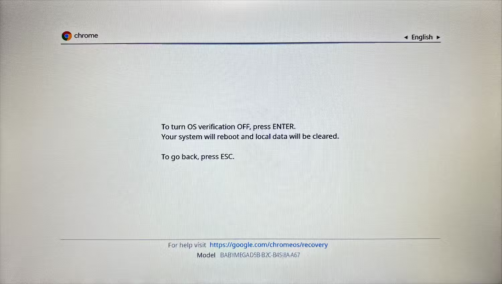
_[image source](https://www.howtogeek.com/210817/how-to-enable-developer-mode-on-your-chromebook/)_

press enter to enable developer mode

</details>

<details>
<summary>on older tablets</summary>

you might see recover screen or black screen
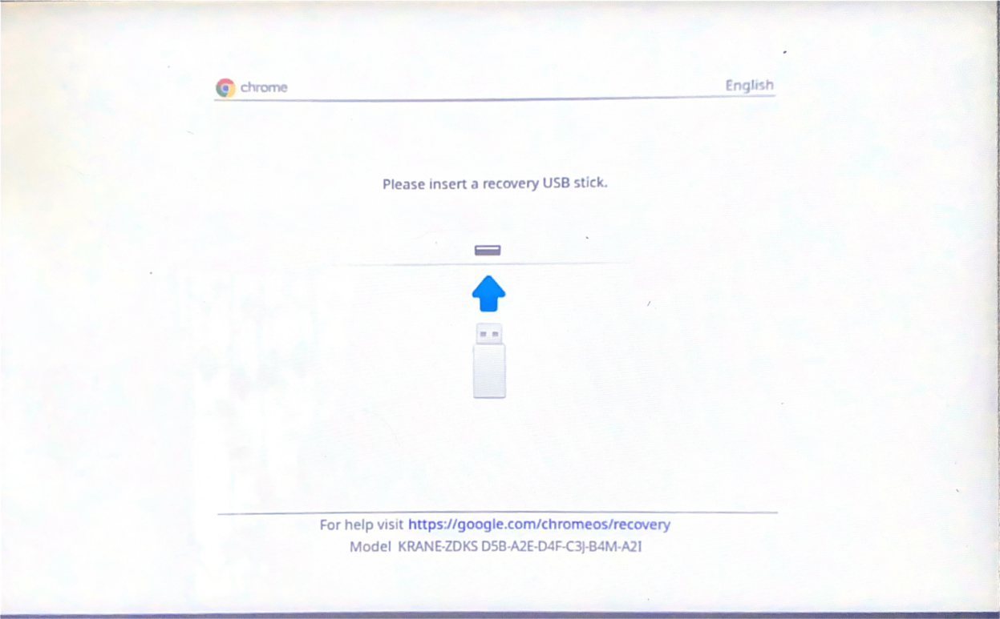
press both ```[volume-up]```+```[volume-down]```
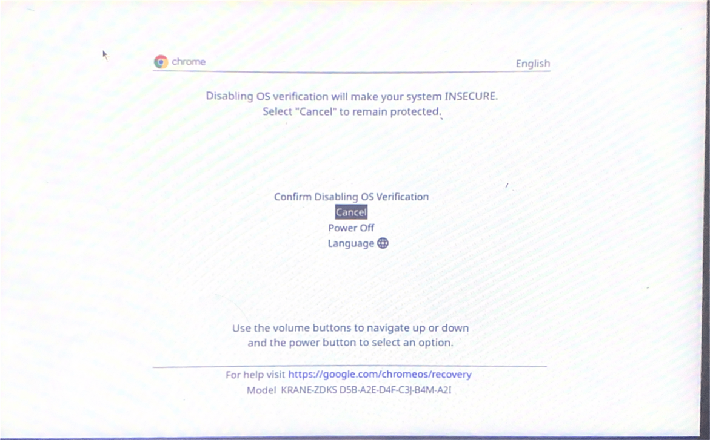
navigate to top option (Confirm Dissabling OS verification) and press ```[power]```

_Note. on some devices with a black screen (but led on the side on) mentioned aboved for example lenovo 10e, the screen output is disabled there for whatever reason (the menu is still there though), but don't worry just press both ```[volume-up]```+```[volume-down]``` then press ```[volume-up]``` a few times then confirm with ```[power]```, after that screen output should be there_

after doing this the device should reboot to this screen
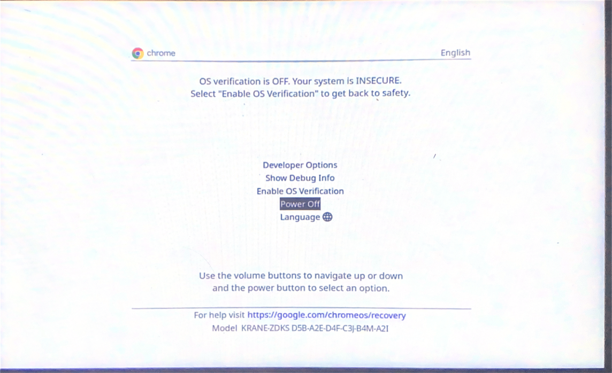

you can wait 30 secs for device to continue automatically or go to developer options
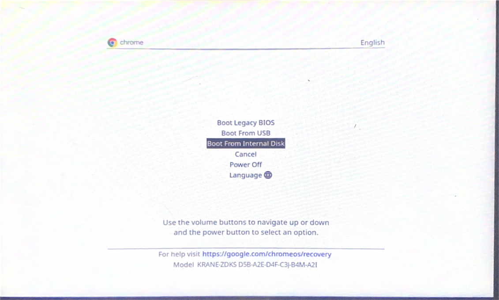
and select to boot from internal disk

</details>

<details>
<summary>on newer devices</summary>

go to advanced options
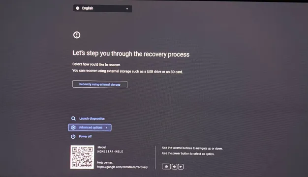

and enable developer mode

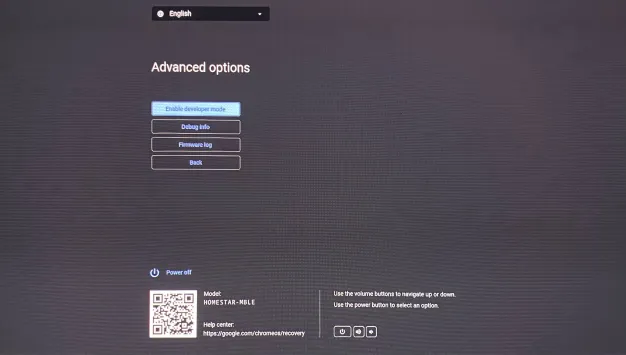

</details>

### accessing console

after your devices finishes you will be able to access console from chrome os

by pressing ```[ctrl]``` ```[alt]``` ```[->]``` or ```[ctrl]``` ```[alt]``` ```[refresh]``` or ```[ctrl]``` ```[alt]``` ```[f2]```

**or**

going into browser an opening
```
chrome-untrusted://crosh
```

then typing
```
shell
```

_Note. on the first boot screen there will be a button to enable debug mode, **don't do that** unless you know what you are doing since it's not needed to access the console and may make doing it more difficult_

# Booting from usb (or sd)

if you are planning to set [gbb flags](./setting_gbb_flags.md) right away you don't have to do this.

after enabling developer mode go into console
and type
```
sudo crossystem dev_boot_usb=1 dev_boot_signed_only=0
```

doing that will enable you to boot from usb/sd card by pressing ```[ctrl]```+```[U]``` at boot menu


or chosing boot from external device on tablets (developer options->boot from external device)


or

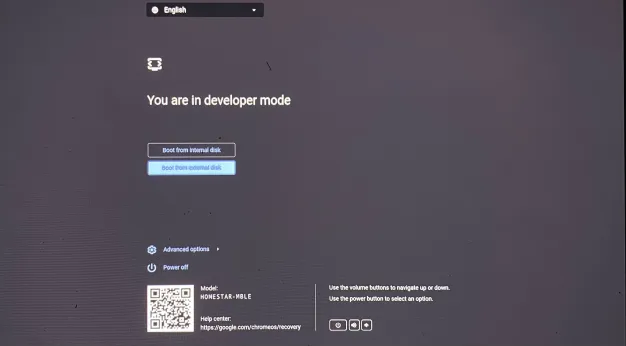

### here we go

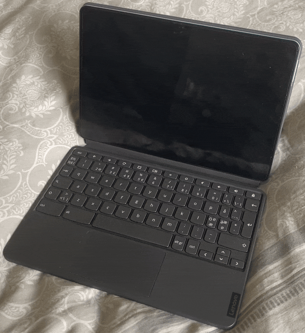

you should have succesfully booted into the operating system 🎉

good job ❤️

_Note. after first boot there are [some commands you might want to run](./first-boot.md)_

# What now? Installation?

well now that you've  managed to boot the system you might want to install it directly onto the device especially if you used usb (usb for reasons has way slower read/write speed than sd card or chromebooks internall memory)

_Note. but before doing it, we recommend you to [set gbb flags](./setting_gbb_flags.md) on your device so when battery runs dry you won't lose access to your system_

_Disclaimer. when you install the content of thses linux images onto the internal storage (mostly emmc, in the future maybe sometimes nvme) of an arm chromebook, everything on the internal storage will be deleted and is lost and one should backup all data from the internal storage._

_Tip. for information about the restoration process post install one can have a look [here](https://support.google.com/chromebook/answer/1080595?hl=en)_

### there are a few ways you could install the system


- [regular](./installation/basic-installation.md) - the simplest one, will copy over content of medium (so the medium can be already preconfigured), system installed on your device disk will **not** be fully encrypted
- [encrypted](./installation/luks-installation.md) - your entire system will be encrypted, you will be forced to type password everytime you boot your device (not recommended for tablets since there is no on screen keyboard)
- [dualboot](./installation/dualboot-instalation.md) - the system will be installed next to chromeos (in theory it can also be done agains any other linux distro or woa but why?). no encryption unless you fuse this guide with encrypted one.

### legacy ways (not recommended)

- [dd](./installation/dd-installation.md) - this method flashes the image directly onto chromebook memory, while it's somewhat simple/fast, it introduces issues the other installations don't