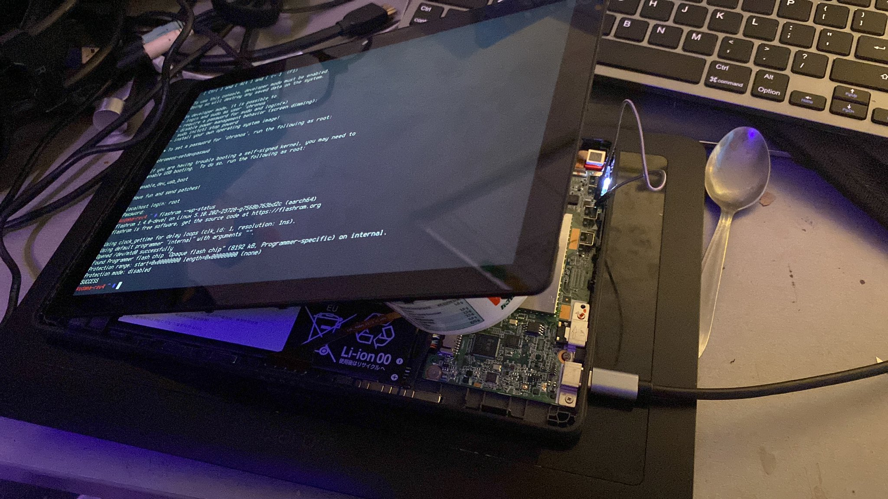

# Why?



setting gbb flags will keep your device in developer mode with option to boot from usb at any time even if your battery runs dry

these flags are usually protected by hardware write protection so you will need to disable it first

**But before**

in order to set gbb flags you need to [enable developer mode](./preparing-chromebook.md) on your device

# Disabling hardware write protection

hardware write protection can be dissabled in a few ways

## Removing a screw or shorting a circut (older chromebooks)

_Warning. opening your chromebook will likely void your warranty and may result in your device being bricked even if you think you know what you are doing_

_Note. only on some chromebooks, if you don't see your device below it either doesn't have this or you will have to look it up urself_

below is a list of known write protection screws/circuts

<details>
<summary>lenovo 10e</summary>

the circut is located on the motherboard

described in [Hardware Maintanance Manual](https://download.lenovo.com/consumer/mobiles_pub/lenovo_10e_chromebook_tablet_hmm_v2.pdf)
</details>

_Tip. **you** can **look** for hardware maintanace manual for ur device **urself**, these are sometimes mentioned there_

_Note. if you find one yourself PR is welcome_

## Disconnecting battery

_Warning. opening your chromebook will likely void your warranty and may result in your device being bricked even if you think you know what you are doing_

_Note. this might not work on all chromebooks, for example [ideapad duet](https://github.com/hexdump0815/imagebuilder/issues/53#issuecomment-2197343028)_

1. this option like the one above requires you to open up your device
2. disconnect the battery from the mainboard and connect
3. connect the device to a charger 
_Note. there are minimal voltage requirements for device to turn on, you device doesn't turn on, it's likely your power source is too weak_
4. turn on your device

as long as the battery is disconnected the write protection should be dissabled on most devices

## Using suzyqable (recommended, modern chromebooks)

in order to perform this you will need suzyqcable to, buy or make one

- https://chromium.googlesource.com/chromiumos/third_party/hdctools/+/HEAD/docs/ccd.md#making-your-own-suzyq
- https://www.youtube.com/watch?v=WGsyXlgSxFk

enter tty and check if CCD (Closed Case Debugging) is opened
```
gsctool -a -I
```

if it is opened you can skip opening it

but if it isn't run
```
gsctool -a -o
```
_Note. it will require you to press PP button (a fancy word for "person presence" button which usually is the power button of the device) shortly (to not power off the device) a few times, if you screen turns off after pressing that button just press it twice in a row quicklu_

after last press the device will shutdonw and you will have to enable developer mode again

now running
```
gsctool -a -I
```
should show that ccd is open

now plugin suzyqcable to you chromebook

_Note. it will on work plugged into one of chromebooks ports and in one orientation_

now check if it works

```
ls /dev/ttyU*
```
output
```
ttyUSB0 ttyUSB1 ttyUSB2
```
_Note. this may not appear on some chromebooks with non chromeos, you can connect the other end diffrent linux pc_
 
_Note. you can connect the device to itself if it has 2 ports_

you can disable hardware writeprotection on any linux/chromeos (as long as device gets detected) with

```
echo "wp false" > /dev/ttyUSB0
echo "wp false atboot" > /dev/ttyUSB0
```

_Note. on debian devices that detect the ttyUSB0 you can use ```minicom /dev/ttyUSB0``` (```sudo apt install minicom```) to see whats going on behind the sceen and type the samec commands, if it complains about modem being missing just ```ln /dev/ttyUSB0 /dev/modem```_

after doing it enable it back just to be safe

```
echo "wp true" > /dev/ttyUSB0
echo "wp true atboot" > /dev/ttyUSB0
```

sources :
- https://www.chromium.org/chromium-os/developer-information-for-chrome-os-devices
- https://wiki.mrchromebox.tech/Firmware_Write_Protect#Disabling_WP_on_CR50_Devices_via_CCD
- https://chromium.googlesource.com/chromiumos/platform/ec/+/cr50_stab/docs/case_closed_debugging_cr50.md
- https://chromium.googlesource.com/chromiumos/docs/+/master/write_protection.md
- https://github.com/jackrosenthal/ec-zephyr-build/blob/master/docs/case_closed_debugging_cr50.md
- https://wiki.mrchromebox.tech/Unbricking
- https://chromium.googlesource.com/chromiumos/platform/ec/+/cr50_stab/docs/case_closed_debugging_cr50.md#Option-2_OpenNoDevMode-and-OpenFromUSB-are-set-to-Always

# Setting gbb flags

gbb flags make it so if your chromebook battery runs dry, you won't lose access to your system

in order to set gbb flags you need to [enable developermode](./preparing-chromebook.md) and disable hardware write protection

1. start by booting chrome os and entering tty with ```[ctrl]``` ```[alt]``` ```[->]``` or ```[ctrl]``` ```[alt]``` ```[refresh]``` or ```[ctrl]``` ```[alt]``` ```[f2]```

2. login with username chronos (no password required)

3. move to directory where ```touch testfile``` works (```cd /tmp``` should be ok)

4. check software write protection with ```flashrom --wp-status```
it will probaly enable, you can disable it with ```flashrom --wp-disable``` and check it again with ```flashrom --wp-status```

*Note. this will only work if the hardware write protection has been disabled beforehand*

<details>
<summary>Recommended step</summary>

read the firmware from the flash into a file ```bios.bin``` via the command ```flashrom -r bios.bin```.

it is a good idea to copy this file to a safe place outside of the chromebook now (sd card, usb stick etc.) to have a copy of the original unmodified firmware around just in case ...
</details>

*Note. in case the boot screen should be changed as well, [look here]() it might be a good idea to do this first to avoid resetting the changed gbb settings again then*

<details>
<summary>there are a few diffrent gbb flags</summary>

```
  GBB_FLAG_DEV_SCREEN_SHORT_DELAY     0x00000001
  GBB_FLAG_LOAD_OPTION_ROMS           0x00000002
  GBB_FLAG_ENABLE_ALTERNATE_OS        0x00000004
  GBB_FLAG_FORCE_DEV_SWITCH_ON        0x00000008
  GBB_FLAG_FORCE_DEV_BOOT_USB         0x00000010
  GBB_FLAG_DISABLE_FW_ROLLBACK_CHECK  0x00000020
  GBB_FLAG_ENTER_TRIGGERS_TONORM      0x00000040
  GBB_FLAG_FORCE_DEV_BOOT_LEGACY      0x00000080
  GBB_FLAG_FAFT_KEY_OVERIDE           0x00000100
  GBB_FLAG_DISABLE_EC_SOFTWARE_SYNC   0x00000200
  GBB_FLAG_DEFAULT_DEV_BOOT_LEGACY    0x00000400
  GBB_FLAG_DISABLE_PD_SOFTWARE_SYNC   0x00000800
  likely more
```
*Note. some values may be not supported by all systems*
</details>

<details>
<summary>it's recommended to use 0x19 for gbb flags</summary>

which combines

- GBB_FLAG_DEV_SCREEN_SHORT_DELAY 0x00000001 - initial boot screen only for 2 seconds instead of the default 30 seconds and no beep afterwards
- GBB_FLAG_FORCE_DEV_SWITCH_ON 0x00000008 - keep developer mode enabled by default
- GBB_FLAG_FORCE_DEV_BOOT_USB 0x00000010 - keep the possibility to boot from usb/sd card enabled by default
</details>

5. set the desired gbb flags via the command ```/usr/share/vboot/bin/set_gbb_flags.sh 0x19```,
on newer chromeos versions (around 112+ or so) one should use ```futility gbb --set --flash --flags=0x19``` instead (but the old command from above seems to still work as well)

6. check current flags via the command ```/usr/share/vboot/bin/get_gbb_flags.sh``` (newer version: ```futility gbb --get --flash --flags```)

7. re-enable the software write protection via ```flashrom --wp-enable```
<details>
<summary>in case you get an error for that command speaking about --wp-range</summary>

- (which seems to happen on newer chromeos versions), then please do the following, [see this](https://chromium.googlesource.com/chromiumos/docs/+/master/write_protection.md#Enabling-write-protect)
  1. run the command ```fmap_decode bios.bin```
  2. note down the range for WP_RO - usually it is 0x00000000 to 0x00200000 (or 0x00400000), but better double check
  3. then rerun the failed command as (with the range noted down above) - for example ```flashrom --wp-enable --wp-range 0x00000000 0x00200000```
</details>

8. re-check the software write protect via ```flashrom --wp-status``` - it should be enabled again now
9. if everything looks good, you can shutdown your system now
10. enable hardware write protection with screw or ccd

sources :

- https://chromium.googlesource.com/chromiumos/docs/+/master/write_protection.md#Enabling-write-protect