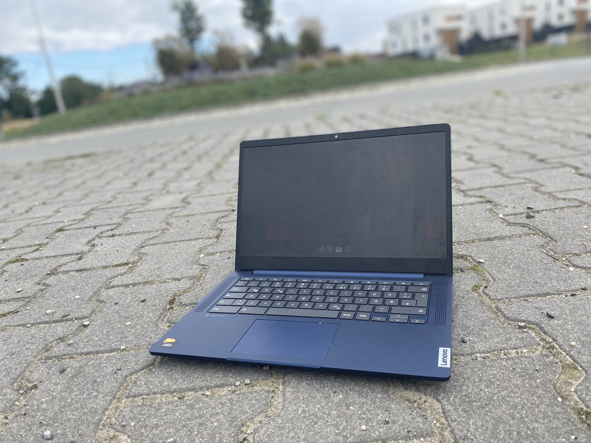

# Lenovo 10e (kodama)

Kernel Version: 6.10.0-next-20240725-cos-mt9+

### Features table
```diff
Basic
+ Internal storage
+ Battery
+ Screen
Peripheria
+ Keyboard
+ Camera
Audio
- Speaker
- Headphones
Connectivity
+ Wifi
! Bluetooth
Connectors
+ USB
+ USB-C
- USB-C to HDMI/DP
+ SD Reader
Other
? Hardware encoding
? Hardware decoding
+ 3D acceleration (Panfrost OpenGL ES 3.1/OpenGL 3.1)
```
_Note. [details on symbols](../adding-device.md)_
### Notes

**Bluetooth**
doesn't work with input device (tested with mouse)
headphones are ok

**Audio**
there is no ucm
trying to enable it might result in burning speakers

**Suspense**
after going into suspense it won't come back
hard restart required

# Other

- [issues](https://github.com/hexdump0815/imagebuilder/issues/228)
- [system notes](../../../../systems/chromebook_corsola/readme.md)