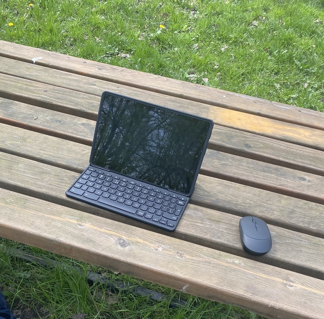

# Lenovo 10e (kodama)

Kernel Version: 6.11.0-stb-mt8+

### Features table
```diff
Basic
+ Internal storage
+ Battery
+ Screen
Peripheria
+ Touch screen
! Stylus
+ Keyboard
- Camera
! Gyroscope
Audio
+ Speaker
+ Headphones
Connectivity
+ Wifi
+ Bluetooth
Connectors
+ USB-C
- USB-C to HDMI/DP
Other
? Hardware encoding
? Hardware decoding
+ 3D acceleration (Panfrost OpenGL ES 3.1/OpenGL 3.1)
```

### Notes

**Camera**
camera doesn't work across all [no laptop devices](https://wiki.postmarketos.org/wiki/Google_Kukui_Chromebook_(google-kukui))

**Audio**
Device after being put into suspense might emit high pitched noises
this can be stopped by running
```systemctl --user restart pipewire-pulse.service```
or
```systemctl --user restart stop pipewire.service```
or
rebooting your device

**Gyroscope**
the oriantation of by 90 degre
it can be fixed by

writing to ```/usr/lib/udev/hwdb.d/60-sensor.hwdb``` :
```
sensor:modalias:*
  ACCEL_MOUNT_MATRIX=0, 1, 0; -1, 0, 0; 0, 0, 1
```
and then running
```sudo systemd-hwdb update && sudo udevadm trigger && sudo reboot```

**Stylus** (flipped)
orientation can be fixed by putting
```
ENV{DEVNAME}=="/dev/input/event6",ENV{LIBINPUT_CALIBRATION_MATRIX}="0 -1 1 1 0 0"
```
in ```/etc/udev/rules.d/99-wormdingler-stylus.rules```

# Other

- [issues](https://github.com/hexdump0815/imagebuilder/issues/202)
- [system notes](../../../../systems/chromebook_kukui/readme.md)