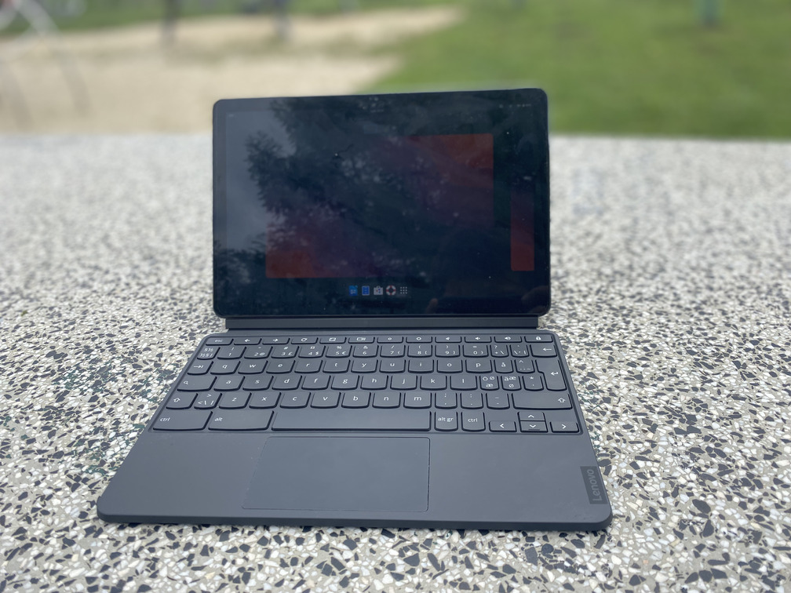

# Lenovo 10e (kodama)

Kernel Version: 6.11.0-stb-mt8+

### Features table
```diff
Basic
+ Internal storage
+ Battery
+ Screen
Peripheria
+ Touch screen
! Touchpad
! Stylus
+ Keyboard
- Camera
+ Gyroscope
Audio
+ Speaker
+ Headphones
Connectivity
+ Wifi
+ Bluetooth
Connectors
+ USB-C
- USB-C to HDMI/DP
Other
? Hardware encoding
? Hardware decoding
+ 3D acceleration (Panfrost OpenGL ES 3.1/OpenGL 3.1)
```
_Note. [details on symbols](../adding-device.md)_
### Notes

**Camera**
camera doesn't work across all [no laptop devices](https://wiki.postmarketos.org/wiki/Google_Kukui_Chromebook_(google-kukui))

**Audio**
Device after being put into suspense might emit high pitched noises
this can be stopped by running
```systemctl --user restart pipewire-pulse.service```
or
```systemctl --user restart stop pipewire.service```
or
rebooting your device

**Stylus**
to get working requires
writing ```/etc/libwacom/google-krane.tablet```:
```
[Device]
Name=hid-over-i2c 27C6:0E30 Stylus
ModelName=
DeviceMatch=i2c:27c6:0e30
Class=ISDV4
Width=5.35433
Height=8.54331
IntegratedIn=Display;System
Styli=@generic-no-eraser

[Features]
Stylus=true
Touch=false
```
and running ```libwacom-update-db```

**Touchpad**
has pressure issues
to work properly requires
writing ```/etc/libinput/local-overrides.quirks```
```
[Google Chromebook Krane Trackpad]
MatchUdevType=touchpad
MatchName=Google Inc. Hammer
MatchBus=usb
MatchDeviceTree=*krane*
ModelChromebook=1
AttrPressureRange=20:10

[Google Chromebook Krane Stylus Digitizer]
MatchUdevType=tablet
MatchDeviceTree=*krane*
MatchBus=i2c
ModelChromebook=1
AttrPressureRange=1100:1000
```
and rebooting device

# Other

- [issues](https://github.com/hexdump0815/imagebuilder/issues/53)
- [system notes](../../../../systems/chromebook_kukui/readme.md)