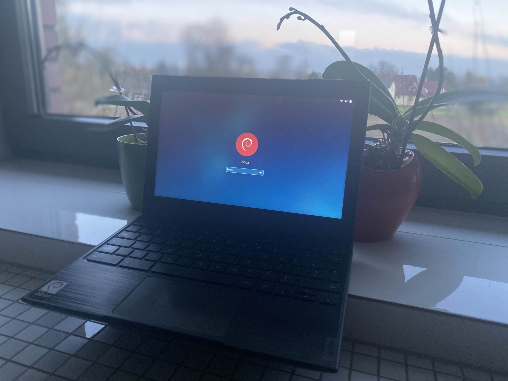

# Lenovo 100e (hana)

Kernel Version: 6.12-stb-mt7+

### Features table
```diff
Basic
+ Internal storage
+ Battery
+ Screen
Peripheria
+ Keyboard
+ Touchpad
+ Camera (gnome cheese has some refreshing issues but works)
Audio
+ Speaker
+ jack
Connectivity
+ Wifi
+ Bluetooth
Connectors
+ USB
- HDMI
Other
? Hardware encoding
? Hardware decoding
- 3D acceleration (only software rendering for now)
```

### Notes

# Other

- [issues](https://github.com/hexdump0815/imagebuilder/issues/271)
- [system notes](../../../../systems/chromebook_oak/readme.md)