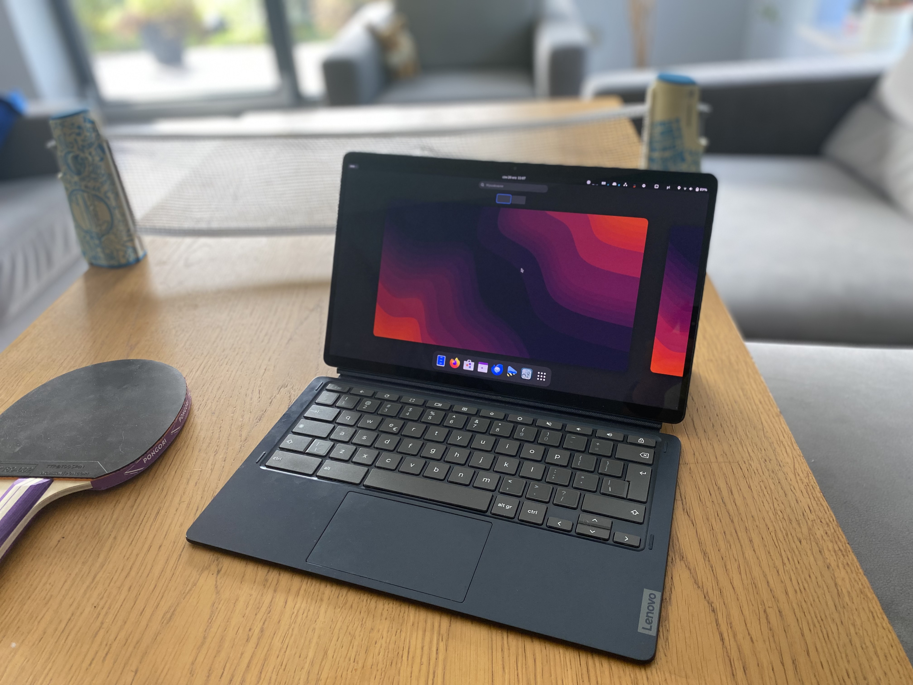

# Lenovo Ideapad duet 5 (homestar) ❤️

Kernel Version: 6.11-stb-cbq+

### Features table
```diff
Basic
+ Internal storage
+ Battery
+ Screen
Peripheria
+ Touch screen
+ Stylus
+ Keyboard
+ Touchpad
- Camera
+ Gyroscope
Audio
! Speaker
Connectivity
+ Wifi
+ Bluetooth
Connectors
+ USB-C
+ USB-C to HDMI/DP
Other
? Hardware encoding
+ Hardware decoding
+ 3D acceleration (Freedreno OpenGL ES 3.2/OpenGL 4.5 Turnip Vulkan 1.3)
```
_Note. [details on symbols](../adding-device.md)_
### Notes

**Camera**
camera doesn't work across all [no laptop devices](https://wiki.postmarketos.org/wiki/Google_Kukui_Chromebook_(google-kukui))

**Speaker**
by default only 2 out of 4 speakers work
4 speakers require [additional package](https://github.com/hexdump0815/imagebuilder/discussions/240#discussioncomment-10732006)

**Screen**
since the device has oled screen it's possible to make it extreamely dark
by running
```
echo 40 | tee /sys/class/backlight/dp_aux_backlight/brightness
```
useful at night, let's consume even less battery
going below 40 results in screen turning off (increasing brightness with brightness key/shortcut turns it back on)

_Fun fact. tablet based trogdor devices are part of sepret sub-group called ["strongbad"](https://cros.tech/device/homestar/)_

# Other

- [issues](https://github.com/hexdump0815/imagebuilder/issues/68)
- [audio](https://github.com/hexdump0815/imagebuilder/discussions/240)
- [system notes](../../../../systems/chromebook_trogdor/readme.md)