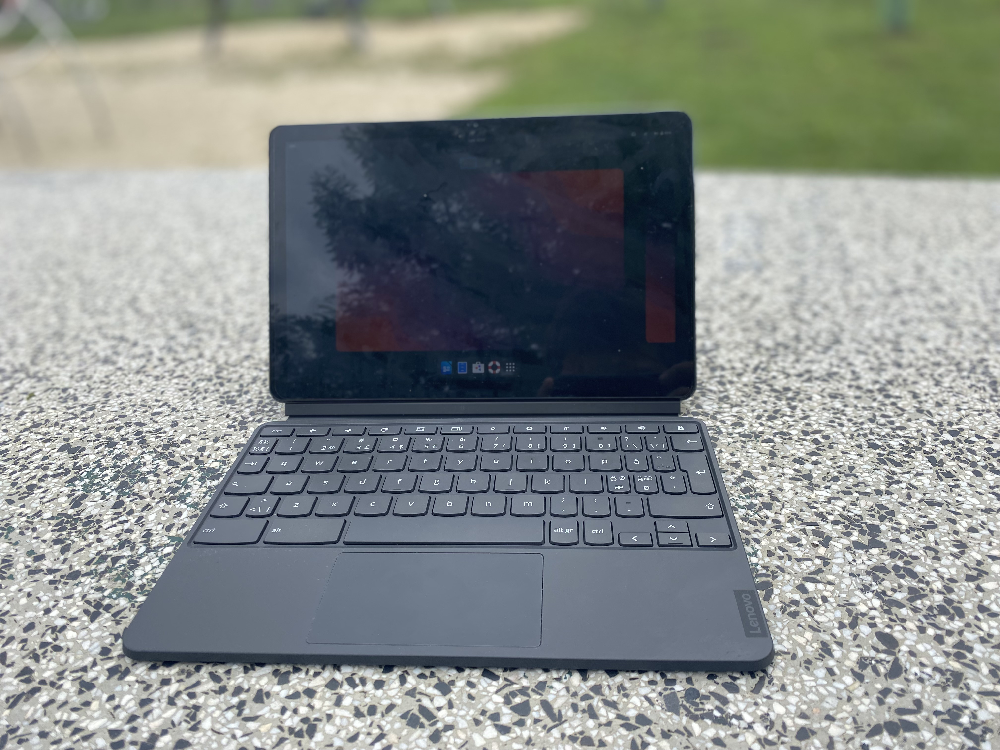

# Acer Chromebook Spin 513 (lazor)

Kernel Version: 6.11-stb-cbq+

### Features table
```diff
Basic
+ Internal storage
+ Battery
+ Screen
Peripheria
+ Touch screen
+ Stylus
+ Keyboard
+ Touchpad
+ Camera
+ Gyroscope
Audio
+ Speaker
+ Headphones
Connectivity
+ Wifi
+ Bluetooth
Connectors
+ USB
+ USB-C
+ USB-C to HDMI/DP
Other
? Hardware encoding
+ Hardware decoding
+ 3D acceleration (Freedreno OpenGL ES 3.2/OpenGL 4.5 Turnip Vulkan 1.3)
```
_Note. [details on symbols](../adding-device.md)_
### Notes

none yet

# Other

- [issues](https://github.com/hexdump0815/imagebuilder/issues/47)
- [system notes](../../../../systems/chromebook_trogdor/readme.md)