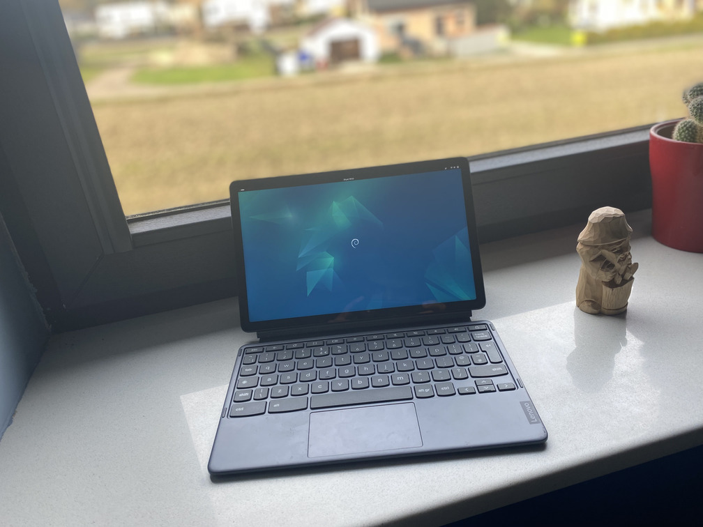

# Lenovo Ideapad duet 3 (wormdingler)

Kernel Version: 6.11-stb-cbq+

### Features table
```diff
Basic
+ Internal storage
+ Battery
+ Screen
Peripheria
+ Touch screen
! Stylus
+ Keyboard
+ Touchpad
- Camera
+ Gyroscope
Audio
+ Speaker
Connectivity
+ Wifi
+ Bluetooth
Connectors
+ USB-C
+ USB-C to HDMI/DP
Other
? Hardware encoding
+ Hardware decoding
+ 3D acceleration (Freedreno OpenGL ES 3.2/OpenGL 4.5 Turnip Vulkan 1.3)
```
_Note. [details on symbols](../adding-device.md)_
### Notes

**Camera**
camera doesn't work across all [no laptop devices](https://wiki.postmarketos.org/wiki/Google_Kukui_Chromebook_(google-kukui))

**Stylus**
the oriantation is incorrect, while it's fixable it requires someone to spend some time on it, [here is a good starting point](https://github.com/hexdump0815/imagebuilder/issues/53#issuecomment-1837517427)


# Other

- [issues](https://github.com/hexdump0815/imagebuilder/issues/182)
- [system notes](../../../../systems/chromebook_trogdor/readme.md)