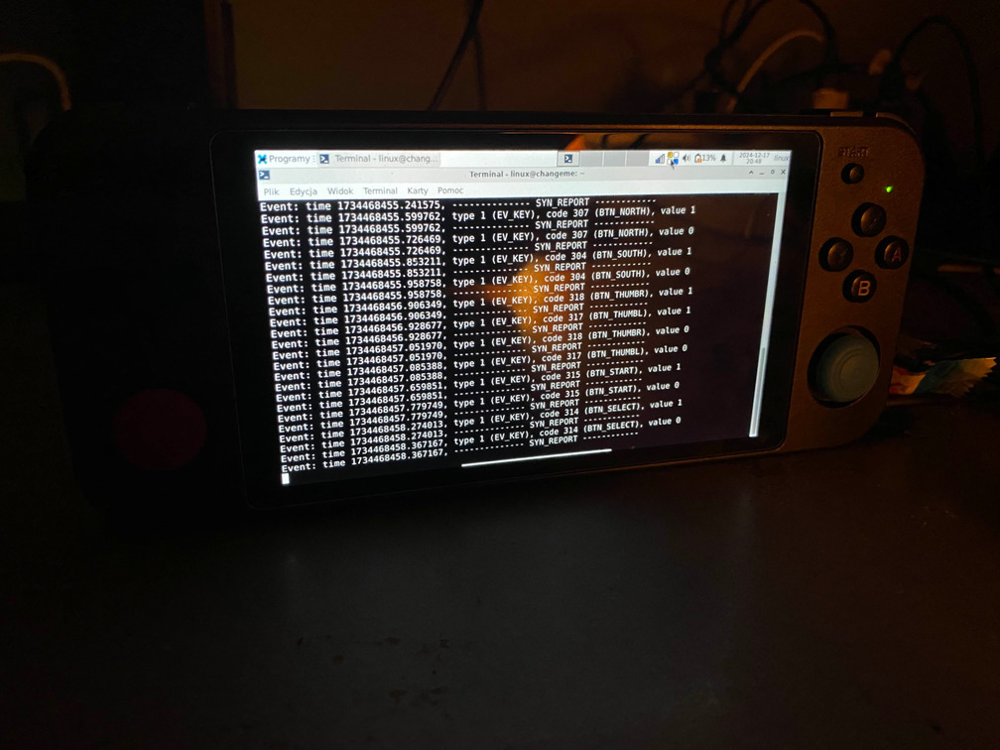

# Intro ... getting stuff to boot
(console edition)

# Booting from sd

booting the system on [these devices](./systems/readme.md) if fairly straightforward

[flash the image](../flashing.md) onto sd card

put it in slot nr.1 and power on the device

it might take a moment

### here we go

you should have succesfully booted into the operating system 🎉

good job ❤️

Now you might be interested in checking out [device specyfic pages](./systems/readme.md)

there are [some commands you might want to run](../first-boot.md)

you can look at this [additional documantation](../postinst/readme.md) for setting other stuff up