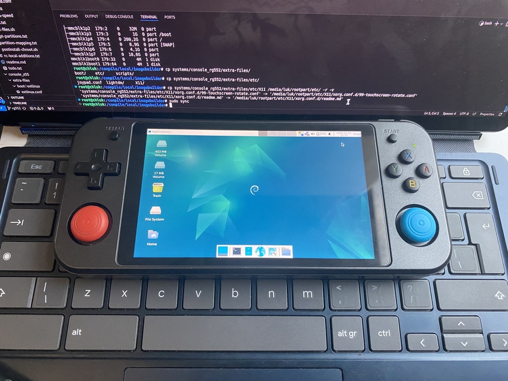

# Anbernic rg552

Kernel Version: 6.12-stb-rg5+

### Features table
```diff
Basic
+ Battery
+ Screen
+ fan control
Peripheria
+ Buttons
+ Touch Screen
Audio
+ Speaker
Connectivity
+ Wifi (only 2.4 Ghz)
Connectors
+ USB-C
+ HDMI
+ 1st SD Reader (boot medium)
+ 2nd SD Reader (free to use for anything)
Other
+ 3D acceleration (Panfrost OpenGL ES 3.1/OpenGL 3.1)
```

## Notes

### 5Ghz Wifi and Bluetooth

if you feel brave and what to get em on your device
here is something for you
https://www.patreon.com/posts/how-to-add-5ghz-63637882

### HDMI
hdmi works under wayland (at least on gnome)
on x11 seams to be buggy

also don't recommend plugging in hdmi at boot if you can
linux **at boot** for whatever reason just rotates the screen out of the blue if one is plugged in
other than that no issues

### USB-C

doesn't work with USB-C hubs
but works with small USB-C to USB-A adapter

### Fan controll

more info can be found [here](./fan_control.md)

### Other

- [issues](https://github.com/hexdump0815/imagebuilder/issues/276)
- [system notes](../../../../systems/console_rg552/readme.md)