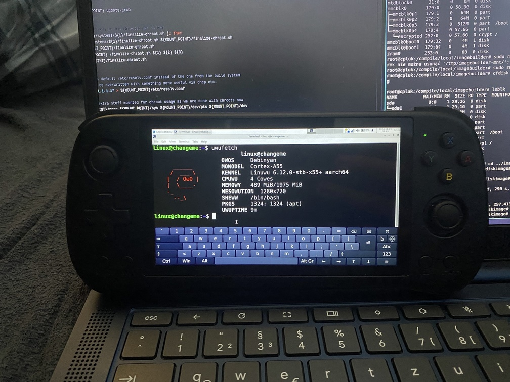

# Powkiddy x55

Kernel Version: 6.12-stb-x55+

### Features table
```diff
Basic
+ Battery
+ Screen
Peripheria
+ Buttons
Audio
+ Speaker
Connectivity
+ Wifi
- Bluetooth
Connectors
+ USB-C
+ HDMI
+ SD Reader
Other
+ 3D acceleration (Panfrost OpenGL ES 3.1/OpenGL 3.1)
```

## Notes

### USB-C

doesn't work with USB-C hubs
but works with small USB-C to USB-A adapter


# Other

- [issues](https://github.com/hexdump0815/imagebuilder/issues/266)
- [system notes](../../../../systems/console_x55/readme.md)