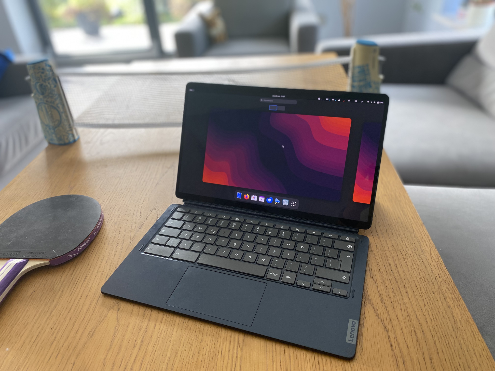

# Getting started using the images

you can strart by simply [flashing image onto your usb/sd (not just copy!)](./flashing.md)

_Tip. you can find the images [here](../readme.md)_

_**Remember.** the default username/password to login is: linux/changeme_

# Installation/Booting

- **Chromebooks** - check [this](./chromebooks/readme.md) out

- **Other devices** - you need to look at [your system notes](../readme.md) for guidance (for now)

# After installation

- you can look at this [additional documantation](./postinst/readme.md) for setting other stuff up

- handling chromebook kernel - [updating/testing/compiling](./chromebooks/kernel/readme.md)

_Note .another good source of information are the already existing github issues of
this repository as quite a few topics and problems were discussed there
already. the top level search of github restricted to "this repository" or
the search box of the issues (best searching across open and closed issues)
seem to work well for searching what is there._