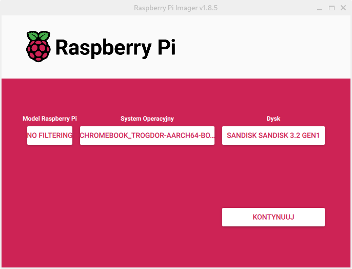

# Preparing usb medium


**Important. simply copying image onto an usb is not a correct way of doing it so please don't do it and then open issues about it not working**

## Flashing on Chromebook or Linux
download the image

using your browser, you can find image for ur specyfic device [here]()

find the name.img.gz (it can be skipped if you already know file location)
```
find / -name *.img.gz 2> /dev/null
```
_Note. ```2> /dev/null``` is for avoiding throwing useless errors and can be removed_

cd to the directory
```
cd path/to/dir
```

unpack the image
```
gunzip name.img.gz
```
find your usb device
```
lsblk
```
_output:_
```
luk@chluk /mnt $ lsblk
NAME         MAJ:MIN RM   SIZE RO TYPE MOUNTPOINTS
mtdblock0     31:0    0     8M  0 disk 
sda      179:0    0 116,5G  0 disk <-- your usb
├─sda1  179:1    0    32M  0 part <-- partition
├─sda2  179:2    0    32M  0 part 
├─sda3  179:3    0   512M  0 part /boot
├─sda4  179:4    0 108,5G  0 part /
└─sda5  179:5    0   7,5G  0 part [SWAP]
```
_Tip. just find a device with same size as ur usb_
_Note. you can also run the command befor and after plugging in the device to be sure_

_Note. your partitions might be different_

flash the image
```
sudo dd status=progress if=name.img of=/dev/<target-device>
```
_Note. replace <target-device> with you usb name from the step above_
_Warning. this operation will wipe your sd/usb drive_

usb should be ready to go 🎉

_Note. if there is any problem with any command just add sudo before it_

## Flashing on any other system

for simplicity just use [raspberry pi imager](https://www.raspberrypi.com/software/)



if you use diffrent software you are on your own, it should work but **do not create and issue about it not working**

_Note. for most you will need to unpack name.img.gz file using archive tool_