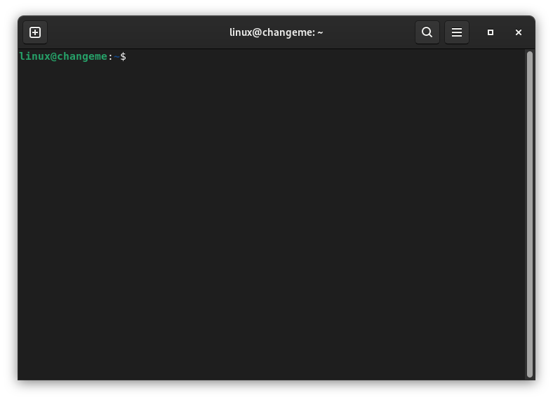

## Change default username

if you want **diffrent username** (default is linux)

login as linux (password "changeme"), open terminal and type

```
sudo passwd root
```
this will let you change root password

logout and login as root and run script
```
/scripts/rename-default-user.sh mypreferredusername
```

_Note. if the user is used by some process just kill it (```kill <process id>```) and run the command again which should throw a group error but don't worry about it :3_

## Change default hostname

in order to change hostname you need to

1. put the new hostname in ```/etc/hostname```
2. and update ```/etc/hosts```
from
```
127.0.0.1	localhost
127.0.1.1	changeme

...
```
to
```
127.0.0.1	localhost
127.0.1.1	newhostname

...
```