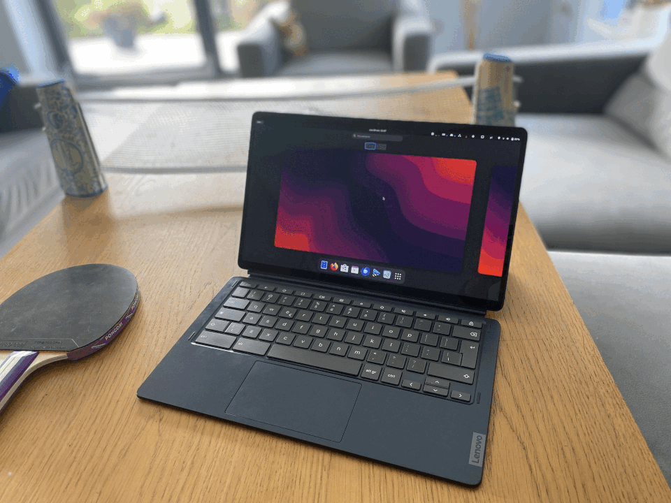

# Customization time

now that you are done with installation there are some additional things you want to setup on your device :

### System setup

- Change username/hostname - [neither "linux" nor "changeme" doesn't suite my vibe](./change-names.md)

- Modifying keyboards keys - [modify specyfic special key to your needs](./modifying-keyboard.md)

- Switching desktop environment - [i want my desktop to look diffrent](./switch-de.md)

### Additional software/packages

- Install waydroid - i want to play and use android apps (to be done)

- Turn into a server - all i need is tty/ssh (to be done)

- Setup splash screen - feel need for my boot screen to look nice (to be done)

- Getting wacom tablets to work - [need to draw something on my tablet](./wacom-tablet-setup.md)

- Installing kernel headers - [i need to compile some stuff with them](./installing-kernel-headers.md)

### Tweaking software

- firefox tuning - [reduce the of writes by firefox](./firefox-tuning.md)

- Fixing firefox touch screen - [the touch screen doesn't let me scroll or type propertly](./firefox.md)

### Device specyfic

- chromebooks - [solutions to device specyfic issues can be found here](../chromebooks/systems/readme.md)
